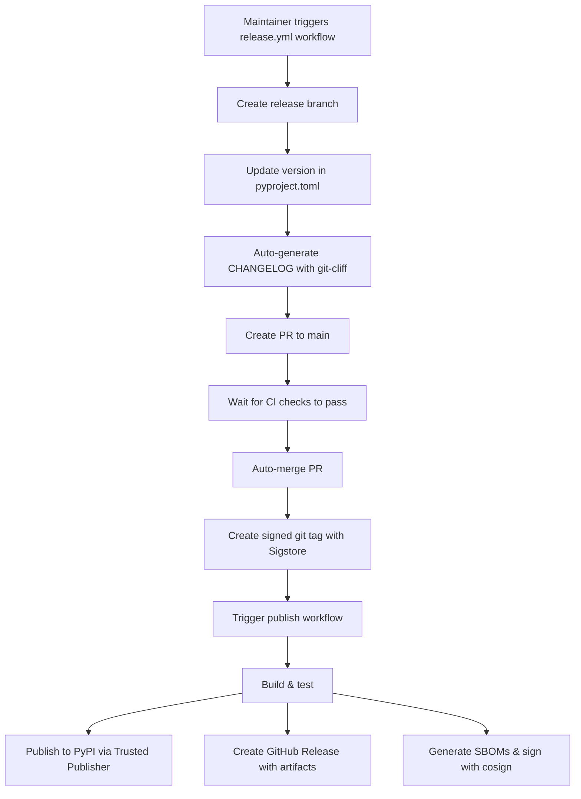

# AGENT.md - miniflux-tui-py Project Guide

This document provides context about the miniflux-tui-py project for coding agents working via the Codex CLI.

## Project Overview

**miniflux-tui-py** is a Python Terminal User Interface (TUI) client for [Miniflux](https://miniflux.app) - a self-hosted RSS reader. It provides a keyboard-driven interface to browse, read, and manage RSS feeds directly from the terminal.

- **Language**: Python 3.11+
- **Supported Python Versions**: 3.11, 3.12, 3.13, 3.14, 3.15 (preview)
- **Framework**: Textual (TUI framework)
- **Status**: Production/Stable (v0.7.3)
- **Development Status**: 5 - Production/Stable (PyPI classifier)
- **License**: MIT
- **Author**: Peter Reuterås
- **PyPI**: Available at <https://pypi.org/project/miniflux-tui-py/>
- **Docs**: <https://reuteras.github.io/miniflux-tui-py/>
- **Roadmap**: See [ROADMAP.md](ROADMAP.md) for v0.7.0+ features
- **Security**: OpenSSF Best Practices, SLSA attestation

This is a Python reimplementation of [cliflux](https://github.com/spencerwi/cliflux) (original Rust implementation).

## Project Maturity

The project has reached **Production/Stable** status with:
- ✅ Comprehensive feature set (categories, feeds, settings, history)
- ✅ Robust CI/CD with GitHub Actions workflows
- ✅ High test coverage (>60%) with async support
- ✅ Security scanning (CodeQL, OSV Scanner)
- ✅ Container builds with SLSA attestation
- ✅ OpenSSF Best Practices badge
- ✅ Professional documentation (MkDocs Material)
- ✅ Automated release workflow with signed commits
- ✅ PyPI Trusted Publisher (OIDC)
- ✅ Multi-platform support (Linux, macOS, Windows)
- ✅ Python 3.11-3.15 support

## Directory Structure

```bash
miniflux-tui-py/
├── miniflux_tui/                    # Main package
│   ├── __init__.py
│   ├── main.py                      # Entry point & CLI argument handling
│   ├── config.py                    # Configuration management
│   ├── constants.py                 # Application constants
│   ├── performance.py               # Performance optimization utilities
│   ├── utils.py                     # Helper utilities
│   ├── api/
│   │   ├── client.py                # Async Miniflux API wrapper
│   │   └── models.py                # Data models (Entry, Feed)
│   └── ui/
│       ├── app.py                   # Main Textual App
│       └── screens/
│           ├── entry_list.py        # Entry list with sorting/grouping
│           ├── entry_reader.py      # Entry detail view
│           ├── entry_history.py     # Entry history view
│           ├── category_management.py # Category management
│           ├── feed_management.py   # Feed management
│           ├── feed_settings.py     # Feed settings editor
│           ├── settings_management.py # User settings
│           ├── status.py            # Status/error dashboard
│           ├── help.py              # Help/keyboard shortcuts
│           ├── confirm_dialog.py    # Confirmation dialog
│           ├── input_dialog.py      # Input dialog
│           ├── settings_edit_dialog.py # Settings editor dialog
│           ├── scraping_helper.py   # Scraping rules helper
│           ├── rules_helper.py      # Filter rules helper
│           └── loading.py           # Loading screen
├── tests/                           # Test suite
│   ├── conftest.py
│   ├── test_*.py                    # Test files
├── docs/                            # MkDocs documentation
│   ├── index.md
│   ├── installation.md
│   ├── configuration.md
│   ├── usage.md
│   ├── contributing.md
│   └── api/
│       ├── client.md
│       ├── models.md
│       └── screens.md
├── .github/
│   ├── workflows/
│   │   ├── test.yml                 # Run tests on push (Python 3.11-3.15)
│   │   ├── release.yml              # Automated release workflow
│   │   ├── publish.yml              # Publish to PyPI on git tags
│   │   ├── docs-deploy.yml          # Deploy docs to GitHub Pages
│   │   ├── codeql.yml               # CodeQL security analysis
│   │   ├── osv-scanner.yml          # OSV vulnerability scanning
│   │   ├── container-image.yml      # Container builds
│   │   ├── zizmor.yml               # Workflow security
│   │   └── pre-commit-autoupdate.yml # Pre-commit hook updates
│   ├── dependabot.yml               # Automated dependency updates
│   └── CODEOWNERS                   # Code review requirements
├── pyproject.toml                   # Project metadata & dependencies
├── mkdocs.yml                       # MkDocs configuration
├── CHANGELOG.md                     # Release notes (Keep a Changelog format)
├── CONTRIBUTING.md                  # Contributing guidelines
├── CODE_OF_CONDUCT.md               # Community guidelines
├── SECURITY.md                      # Vulnerability reporting
├── AUTHORS.md                       # Contributor credits
├── README.md                         # User documentation
├── LICENSE                          # MIT License
└── .pre-commit-config.yaml          # Pre-commit hooks
```

## Key Files & Responsibilities

### Core Files

| File                                | Purpose                                                                  |
|-------------------------------------|--------------------------------------------------------------------------|
| `main.py`                           | CLI entry point; handles `--init`, `--check-config`; runs async app      |
| `config.py`                         | Config loading/saving with platform-specific paths (XDG, macOS, Windows) |
| `constants.py`                      | Application constants and configuration                                  |
| `performance.py`                    | Performance optimization utilities                                       |
| `utils.py`                          | Helper utilities                                                         |
| `api/client.py`                     | Async wrapper around official miniflux Python library with retry logic   |
| `api/models.py`                     | Dataclasses: `Category`, `Entry`, `Feed` with helper properties          |
| `ui/app.py`                         | Main `MinifluxTuiApp` Textual App; screen management; entry loading      |
| `ui/screens/entry_list.py`          | Entry list screen with sorting, grouping, navigation                     |
| `ui/screens/entry_reader.py`        | Entry detail view with HTML→Markdown conversion                          |
| `ui/screens/entry_history.py`       | Entry history browsing                                                   |
| `ui/screens/category_management.py` | Category CRUD operations                                                 |
| `ui/screens/feed_management.py`     | Feed discovery and management                                            |
| `ui/screens/feed_settings.py`       | Feed settings editor                                                     |
| `ui/screens/settings_management.py` | User settings management                                                 |
| `ui/screens/status.py`              | Status dashboard for problematic feeds                                   |

### Recent Modifications (Key Behaviors)

#### entry_list.py
- **Sorting modes**: "date" (newest first), "feed" (alphabetical + date), "status" (unread first)
- **Grouping**: When enabled (`g` key), groups by feed title and sorts by published date within each feed
- **Grouped mode navigation**: Uses CSS-based hiding to preserve cursor position
  - All entries are always in the list (structure never changes)
  - Collapsed entries have "collapsed" CSS class (display: none)
  - j/k navigation skips hidden entries automatically
  - Cursor position naturally preserved during expand/collapse
- **Navigation**: `j`/`k` (or arrow keys) to navigate; skips hidden entries
- **Stored state**: `self.sorted_entries` tracks currently sorted order for proper J/K navigation in entry reader
- **Filtering**: `u` (unread only), `t` (starred only)
- **Key bindings**:
  - `j/k` - cursor down/up (skips hidden entries)
  - `enter` - select entry
  - `m` - toggle read/unread
  - `*` - toggle starred
  - `e` - save entry
  - `s` - cycle sort mode
  - `g` - toggle group by feed
  - `l/h` - expand/collapse feed
  - `r/,` - refresh entries
  - `u` - show unread only
  - `t` - show starred only

#### entry_reader.py
- **Display**: Shows entry title, feed name, publish date, URL, and HTML content (converted to Markdown)
- **Navigation**: `J/K` (uppercase) to navigate between entries in current list order
- **Actions**: Mark unread, toggle starred, open in browser, fetch original content
- **Feed settings**: `X` key to open feed settings editor
- **Critical fix**: Uses `entry_list` parameter passed from entry_list screen for correct navigation order

#### category_management.py
- **CRUD operations**: Create, rename, delete categories
- **Feed assignment**: Move feeds between categories
- **Validation**: Prevents deletion of categories with feeds
- **Integration**: Seamlessly updates entry list when categories change

#### feed_management.py
- **Feed discovery**: Auto-discover feeds from URLs
- **Feed creation**: Add new feeds to categories
- **Settings preview**: Quick access to feed settings

#### feed_settings.py
- **Comprehensive editor**: Edit all feed settings
- **Scraping rules**: Configure content extraction
- **Rewrite rules**: URL and content rewriting
- **Fetch settings**: Full content fetching, user agent, cookies
- **Blocklist rules**: Entry filtering by title, URL, content
- **Allow rules**: Entry whitelisting

#### entry_history.py
- **History browsing**: View last read entries
- **Date filtering**: Filter by date range
- **Feed filtering**: Filter by specific feed
- **Search**: Search through history

#### settings_management.py
- **User settings**: View and edit global settings
- **Integration status**: Display enabled integrations
- **Web UI links**: Quick access to advanced settings

#### status.py
- **Feed status**: Display problematic feeds
- **Error indicators**: SSL issues, bot protection, timeouts
- **Server info**: Show Miniflux server version and URL
- **Direct links**: Open feed settings in web UI

## Architecture Patterns

### Async/Await Pattern
- UI is synchronous (Textual), API calls are async
- `api/client.py` converts sync miniflux calls to async using `run_in_executor`
- Screen actions marked with `async def` when making API calls

### Screen Navigation
- `EntryListScreen` → User selects entry → `push_entry_reader(entry, entry_list, current_index)`
- Entry reader can navigate with J/K using the `entry_list` passed at open time
- Back button pops screen and returns to entry list

### Data Flow
```bash
config.py (load/validate)
  → app.py (create MinifluxTuiApp)
  → client.py (async API calls)
  → models.py (Entry/Feed objects)
  → screens (display & user interaction)
```

## Setup & Development

### Installation

#### Option 1: From PyPI (Recommended for users)
```bash
uv tool install miniflux-tui-py

# Create config
miniflux-tui --init

# Run application
miniflux-tui
```

#### Option 2: From Source (Recommended for development)
```bash
# Install uv package manager - see https://docs.astral.sh/uv/getting-started/installation/
# On macOS/Linux: brew install uv
# On Windows: choco install uv

# Clone and setup
git clone https://github.com/reuteras/miniflux-tui-py.git
cd miniflux-tui-py
uv sync --all-groups  # Install all dependencies including dev and docs tools

# Create config (interactive)
uv run miniflux-tui --init

# Run application
uv run miniflux-tui
```

### Git Workflow

Direct commits to main are allowed. Feature branches are optional but fine for larger changes.

**Before committing (run checks!):**

```bash
uv run ruff check .              # Lint
uv run ruff format .             # Format
uv run pyright                   # Type check
uv run pytest tests              # Run tests
```

**Commit message format** (conventional commits help with changelog generation):

```bash
git commit -m "feat: Add new feature"
git commit -m "fix: Fix bug in navigation"
git commit -m "docs: Update README"
git commit -m "refactor: Refactor entry list"
git commit -m "chore: Update dependencies"
```

**⚠️ CRITICAL: SSH SIGNING WITH 1PASSWORD**

**If commit signing fails or doesn't work, STOP and WAIT immediately. Do NOT proceed.**

This project uses 1Password for SSH commit signing approval. When you attempt to commit:
- If signing works: 1Password will prompt for approval, and the commit will be signed
- If signing fails: It means the maintainer (Peter) is away or busy and cannot approve
- If 1Password is unreachable: WAIT - do not attempt to work around this

**Never:**
- ❌ Try to disable signing (commit.gpgsign=false)
- ❌ Try to commit without signing
- ❌ Use alternate signing methods
- ❌ Attempt any workaround

**If you get signing errors:**
1. Stop all work
2. Wait for the maintainer to come back online
3. Check that 1Password SSH Agent is running (macOS: System Preferences → Password Manager → SSH Agent)
4. Retry the commit

This ensures all commits are verified and trusted.

### Common Commands
```bash
uv sync --all-groups             # Install all dependencies (dev + docs)
uv run miniflux-tui              # Run app
uv run miniflux-tui --init       # Create config
uv run ruff check .              # Lint code
uv run ruff format .             # Format code
uv run pyright                   # Type check
uv run pytest tests              # Run tests
uv run mkdocs serve              # Preview docs locally
```

### Configuration (TOML Format)

Location varies by OS:
- Linux: `~/.config/miniflux-tui/config.toml`
- macOS: `~/.config/miniflux-tui/config.toml`
- Windows: `%APPDATA%\miniflux-tui\config.toml`

Example:
```toml
server_url = "https://miniflux.example.com"
api_key = "your-api-key-here"
allow_invalid_certs = false

[theme]
unread_color = "cyan"
read_color = "gray"

[sorting]
default_sort = "date"       # "date", "feed", or "status"
default_group_by_feed = false
```

## Code Style & Standards

- **Line length**: 140 characters
- **Indentation**: 4 spaces
- **Quotes**: Double quotes
- **Target Python**: 3.11+
- **Linting**: ruff (fast Python linter & formatter) with extensive rule set:
  - pycodestyle (E, W)
  - pyflakes (F)
  - isort (I)
  - pep8-naming (N)
  - pyupgrade (UP)
  - flake8-bugbear (B)
  - flake8-bandit security (S)
  - flake8-comprehensions (C4)
  - And many more (see pyproject.toml)
- **Type checking**: pyright (standard mode) on all code and tests
- **Security**: bandit SAST scanning
- **Testing**: pytest with coverage tracking (minimum 60%)
- **Pre-commit hooks**: Enforces syntax, security checks, formatting, and type checking
- **CI/CD**: GitHub Actions runs all checks on push
- **Documentation**: MkDocs with Material theme, auto-deployed to GitHub Pages
- **Commit signing**: Required (SSH with 1Password)

## Important Implementation Details

### Entry List Ordering Issue (FIXED)
**Problem**: When grouping entries by feed, J/K navigation didn't follow visual order.

**Root cause**: `entry_list.py` was passing unsorted `self.entries` to entry reader instead of the sorted version.

**Solution**:
- Added `self.sorted_entries` to track current sort order
- Pass `self.sorted_entries` to entry reader for correct J/K navigation
- Find entry index in sorted list, not original list

### Cursor Navigation (FIXED)
**Problem**: `j/k` keys didn't work in entry list.

**Root cause**: `action_cursor_down/up` tried to use `self.app.set_focus()` on nested ListItems (invalid widget hierarchy).

**Solution**: Delegate directly to ListView's `action_cursor_down()` and `action_cursor_up()` methods.

## Common Tasks

### Adding a New Keyboard Binding
1. Add `Binding` tuple to `BINDINGS` list in the screen class
2. Create `action_*` method in the same screen
3. For API calls, mark as `async def` and await the call

Example:
```python
BINDINGS = [
    Binding("x", "do_something", "Do Something"),
]

async def action_do_something(self):
    """Description."""
    if hasattr(self.app, "client"):
        await self.app.client.some_api_call()
```

### Adding a New Screen
1. Create file in `ui/screens/`
2. Extend `Screen` class from textual
3. Implement `compose()` for UI layout
4. Add bindings and action methods
5. Push screen from app: `self.app.push_screen(MyScreen())`

### Modifying Entry Display
- Entry list: Edit `EntryListItem` in `entry_list.py`
- Entry detail: Edit `compose()` and `refresh_screen()` in `entry_reader.py`
- Remember to keep data model in sync via `api/models.py`

## Dependencies

**Runtime**:
- `textual>=6.4.0` - TUI framework
- `miniflux>=1.1.4` - Official Miniflux API client
- `html2text>=2025.4.15` - HTML to Markdown conversion
- `tomli>=2.0.1` - TOML parsing (Python <3.11)
- `beautifulsoup4>=4.14.2` - HTML parsing
- `html5lib>=1.1` - HTML5 parsing
- `bleach>=6.3.0` - HTML sanitization
- `httpx>=0.28.1` - HTTP client

**Development** (included with `uv sync`):
- `ruff>=0.6.0` - Fast linter & formatter
- `pyright>=1.1.0` - Static type checker
- `pytest>=8.0.0` - Testing framework
- `pytest-asyncio>=0.23.0` - Async test support
- `pytest-cov>=4.0.0` - Coverage reporting
- `pytest-benchmark>=4.0.0` - Performance benchmarking
- `pylint>=4.0.2` - Additional code linting
- `bandit[toml]>=1.7.5` - Security linting

**Documentation** (included with `uv sync` or via docs dependency group):
- `mkdocs>=1.6.1` - Documentation generator
- `mkdocs-material>=9.6.22` - Material theme for MkDocs
- `mkdocstrings[python]>=0.30.1` - Auto-generate API docs from docstrings

**Optional**:
- `atheris>=2.3.0` - Fuzzing support (fuzz dependency group)
- `pyinstaller>=6.10.0` - Binary packaging (binary dependency group)

## Known Patterns & Conventions

### Screen Initialization
Screens receive data via constructor params, not global state:
```python
def __init__(self, entry: Entry, entry_list: list, current_index: int, **kwargs):
    super().__init__(**kwargs)
    self.entry = entry
    self.entry_list = entry_list
    self.current_index = current_index
```

### Async API Calls
Always check for app.client before calling:
```python
async def action_mark_read(self):
    if hasattr(self.app, "client") and self.app.client:
        await self.app.client.mark_as_read(self.entry.id)
```

### State Updates
- Screens update local data model (`entry.is_read = True`)
- Call API to persist changes
- Call `_populate_list()` or `refresh_screen()` to update UI

## Recent Changes (v0.7.x)

Latest releases (November 2025):

### v0.7.3 (2025-11-27)
- **Feature**: Runtime theme switching - instant dark/light mode toggle without restart
- **Feature**: Non-blocking background operations - sync while navigating/reading entries
- **Performance**: All data-fetching operations now use run_worker for responsive UI

### v0.7.2 (2025-11-17)
- **Bug fix**: Added missing ID to Markdown widget to fix NoMatches error

### v0.7.1 (2025-11-17)
- **Feature**: Dark/Light theme toggle support
- **Bug fix**: Prevented immutable release error in publish workflow

### v0.6.5 (2025-11-16)
- **Feature**: Phase 11 - UX Polish & Documentation
- **Bug fixes**:
  - Enhanced scorecard workflow
  - Fixed unawaited coroutine in EntryHistoryScreen
  - Connected FeedSettingsScreen to entry reader X key binding
  - Comprehensive SafeHeader exception handling for Windows Python 3.11+
  - Fixed TextArea visibility in FeedSettingsScreen
  - Return error code 1 when --check-config password command fails

### v0.5.0-v0.6.0 (September-November 2025)
Major feature additions:
- **Category support**: Full CRUD operations for categories
- **Feed management**: Create, discover, edit feeds
- **Feed settings editor**: Comprehensive feed configuration
- **Entry history**: Browse reading history with date/feed filters
- **User settings**: View and edit global feed settings
- **Status dashboard**: View problematic feeds and errors
- **Grouped mode navigation**: CSS-based hiding with preserved cursor position
- **PyPI package infrastructure**: OIDC secure publishing
- **Comprehensive documentation**: MkDocs site with installation, usage, and API reference
- **GitHub Actions CI/CD**:
  - Automated testing on Python 3.11, 3.12, 3.13, 3.14, 3.15 preview
  - Type checking with pyright
  - Security scanning (CodeQL, OSV Scanner)
  - Test coverage tracking with coveralls
  - Auto-deploy docs to GitHub Pages
  - Auto-publish to PyPI on version tags
  - Container builds with SLSA attestation
- **Professional tooling**:
  - Pre-commit hooks with pyright type checking
  - Standard community files (CHANGELOG, CONTRIBUTING, CODE_OF_CONDUCT, SECURITY)
  - Dependabot for automated dependency updates
- **Code quality**:
  - Added constants.py for centralized configuration
  - Added performance.py for optimization tracking
  - Added utils.py for helper functions
  - Incremental refresh for better performance

## Testing & Quality Assurance

- **Automated CI/CD**: GitHub Actions runs on every push
  - Tests Python 3.11, 3.12, 3.13, 3.14 with 3.15 preview
  - Minimum 60% test coverage required (tracked with coveralls)
  - Type checking with pyright
  - Linting with ruff
  - Security scanning:
    - CodeQL (static analysis)
    - OSV Scanner (vulnerability scanning)
    - Bandit (Python security linter)
  - Container builds with SLSA attestation
- **Pre-commit hooks**: Enforces quality before commit
  - ruff linting and formatting
  - pyright type checking
  - YAML validation
  - Security checks
- **Manual testing**: Test with different Miniflux instances and feed sizes
- **Test suite**: Comprehensive pytest coverage in tests/ directory with async support

## Release Process for AI Agents

**⚠️ CRITICAL: AI agents should NEVER manually run releases. Releases are maintainer-only operations.**

### When Releases Happen

Releases are created by project maintainers using the fully automated GitHub Actions workflow:

```bash
# Via GitHub UI: Actions → Create Release → Run workflow
# Or via CLI:
gh workflow run release.yml --ref main --field version=0.5.6
# Or auto-bump:
gh workflow run release.yml --ref main --field bump_type=patch
```

The workflow automates everything:
1. Creates release branch with version + changelog updates (using git-cliff)
2. Creates PR to main and waits for CI checks
3. Auto-merges PR when tests pass
4. Creates signed git tag (using Sigstore Gitsign)
5. Triggers publish workflow which publishes to PyPI, creates GitHub release with all artifacts

Total time: ~10 minutes, zero manual steps required.

See [RELEASE.md](RELEASE.md) for complete documentation.

### How AI Agents Can Help

While agents should never release, they can assist with pre-release preparation:

**1. Feature Implementation**
- Follow conventional commit format: `feat:`, `fix:`, `docs:`, `refactor:`, etc.
- Include PR numbers in commit messages: `feat: Add feature (#123)`
- This enables automatic changelog generation

**2. Pre-Release Quality Checks**
- Ensure all tests pass: `uv run pytest tests --cov=miniflux_tui`
- Verify linting: `uv run ruff check miniflux_tui tests`
- Check types: `uv run pyright miniflux_tui tests`
- Review test coverage (minimum 60% required)

**3. Documentation Updates**
- Update docstrings for new features
- Update `docs/` when adding user-facing features
- Ensure README.md reflects current capabilities
- Keep code examples up to date

**4. Version Planning**
When asked about releases, help determine semantic version:
- **Patch (0.2.1)**: Bug fixes only, no new features
- **Minor (0.3.0)**: New features, backward compatible
- **Major (1.0.0)**: Breaking changes

**5. Changelog Preparation**
- Group commits by type (feat, fix, docs, etc.)
- Reference relevant issue/PR numbers
- Highlight breaking changes
- Note deprecations

### What NOT to Do

**NEVER:**
- ❌ Trigger the release workflow
- ❌ Manually edit version in `pyproject.toml` for release
- ❌ Create or push git tags
- ❌ Manually publish to PyPI
- ❌ Create GitHub releases
- ❌ Modify release workflows without maintainer approval

### Release Workflow Overview

For reference, here's how the automated release process works:



### CI/CD Pipeline

The publish workflow (`.github/workflows/publish.yml`) is triggered by version tags:
- Triggers on: `v[0-9]+.[0-9]+.[0-9]+` (e.g., v0.3.0)
- Runs: Full test suite, linting, type checking
- Builds: Distribution packages (tar.gz + wheel)
- Publishes: To PyPI using OpenID Connect (no secrets!)
- Creates: GitHub Release with artifacts
- Generates: SLSA provenance for supply chain security

### PyPI Trusted Publisher

The project uses PyPI's Trusted Publisher (OIDC) for secure publishing:
- No API tokens stored in GitHub secrets
- Direct authentication from GitHub Actions to PyPI
- Configured at: <https://pypi.org/account/publishing/>
- Environment: `pypi`
- Workflow: `publish.yml`

### Release Checklist Reference

If a maintainer asks for help preparing a release:

**Pre-Release:**
- [ ] All changes committed to main
- [ ] All tests passing: `uv run pytest tests`
- [ ] Code formatted: `uv run ruff format .`
- [ ] Linting clean: `uv run ruff check .`
- [ ] Types valid: `uv run pyright`
- [ ] Documentation updated
- [ ] ROADMAP.md reflects current status

**Post-Release (Verification):**
- [ ] GitHub Actions workflow passed
- [ ] Release visible on GitHub: <https://github.com/reuteras/miniflux-tui-py/releases>
- [ ] Package on PyPI: <https://pypi.org/project/miniflux-tui-py/>
- [ ] Installation works: `pip install miniflux-tui-py --upgrade`

### Conventional Commit Format

The changelog generator relies on conventional commits. Always use this format:

```text
<type>: <description>

<optional detailed description>

<optional footer>
```

**Types:**
- `feat`: New features
- `fix`: Bug fixes
- `docs`: Documentation changes
- `style`: Code style (formatting, no logic change)
- `refactor`: Code refactoring
- `perf`: Performance improvements
- `test`: Test additions or fixes
- `ci`: CI/CD changes
- `chore`: Maintenance tasks

**Examples:**
```bash
feat: Add category filtering to entry list (#42)
fix: Correct cursor position after feed collapse (#55)
docs: Update installation instructions for Windows
refactor: Extract API retry logic into separate function
test: Add integration tests for feed refresh
```

### Release Documentation References

- [RELEASE.md](RELEASE.md) - Complete release documentation
- [CHANGELOG.md](CHANGELOG.md) - Release history
- [ROADMAP.md](ROADMAP.md) - Planned features by version
- [.github/workflows/release.yml](.github/workflows/release.yml) - Automated release workflow
- [cliff.toml](cliff.toml) - git-cliff configuration for changelog generation

## Common Development Patterns

### Adding a New Feed Setting
1. Check if the Miniflux API supports the setting (check miniflux Python client)
2. Add field to `Feed` model in `api/models.py`
3. Add UI widget in `feed_settings.py` compose method
4. Add save logic in `action_save()` method
5. Test with real Miniflux server

### Adding a New Screen
1. Create new file in `ui/screens/`
2. Import required Textual widgets and components
3. Define `BINDINGS` for keyboard shortcuts
4. Implement `compose()` for UI layout
5. Add action methods for bindings
6. Add screen to app routing in `ui/app.py`
7. Add tests in `tests/`

### Working with Dialogs
Use existing dialog components:
- `ConfirmDialog` - Yes/No confirmations
- `InputDialog` - Text input
- `SettingsEditDialog` - Settings editor

Push dialog and await result:
```python
result = await self.app.push_screen_wait(ConfirmDialog("Are you sure?"))
if result:
    # User confirmed
```

### API Error Handling
Always wrap API calls in try/except:
```python
try:
    result = await self.app.client.some_api_call()
except Exception as e:
    self.app.notify(f"Error: {e}", severity="error")
    return
```

### Performance Considerations
- Use `@work` decorator for long-running operations
- Display loading screens for slow operations
- Cache frequently accessed data
- Use incremental updates when possible

## Troubleshooting

**Keys don't work**: Check bindings list in screen class - must have matching `action_*` method.

**Navigation jumps around**: Verify `current_index` and `entry_list` are passed correctly to entry reader from entry list.

**Config not found**: Run `uv run miniflux-tui --init` to create default config in correct OS-specific location.

**API errors**: Check network connectivity and API key in config; verify Miniflux server is accessible.

**Pre-commit hooks fail**: Run `uv run ruff format .` and `uv run ruff check . --fix` to auto-fix most issues.

**Type checking errors**: Run `uv run pyright` locally to see full error details. Add type hints or use `# type: ignore` with comment explaining why.

**Tests fail**: Ensure you're using the right Python version (3.11+) and have synced dependencies with `uv sync --all-groups`.

**Container build fails**: Check that all dependencies are properly declared in `pyproject.toml` and that the Dockerfile is using the correct base image.

**Commit signing fails**: Stop and wait for maintainer.

**Coverage too low**: Add more tests in `tests/` directory. Aim for >60% coverage. Use `uv run pytest --cov=miniflux_tui --cov-report=html` to see coverage report.

## Key Features (as of v0.7.3)

### Core Functionality
- ✅ Browse and read RSS entries with keyboard navigation
- ✅ Mark entries as read/unread, starred/unstarred
- ✅ Save entries to third-party services (Pocket, Instapaper, etc.)
- ✅ Open entries in browser
- ✅ Fetch original content for truncated entries
- ✅ HTML to Markdown conversion for readable display

### Organization & Filtering
- ✅ Sort by date (newest first), feed (alphabetical), or status (unread first)
- ✅ Group entries by feed with expand/collapse
- ✅ Filter by unread only or starred only
- ✅ Search through entries
- ✅ Category-based organization
- ✅ Feed-based filtering

### Feed Management
- ✅ Auto-discover feeds from URLs
- ✅ Create/edit/delete feeds
- ✅ Configure feed settings (scraping rules, rewrite rules, fetch settings)
- ✅ Refresh individual feeds or all feeds
- ✅ View feed status and errors
- ✅ Configure entry filtering (blocklist/allowlist rules)

### Category Management
- ✅ Create/rename/delete categories
- ✅ Move feeds between categories
- ✅ Category-based grouping

### User Settings
- ✅ View and edit global feed settings
- ✅ View enabled integrations
- ✅ Configure theme (dark/light mode)
- ✅ Customize colors and appearance

### History & Status
- ✅ Browse reading history
- ✅ Filter history by date range or feed
- ✅ Search through history
- ✅ View problematic feeds and errors
- ✅ Display server version and URL

### Advanced Features
- ✅ Keyboard-driven interface with extensive shortcuts
- ✅ Async API calls for responsive UI
- ✅ Configuration via TOML file
- ✅ Platform-specific config paths (XDG, macOS, Windows)
- ✅ Password command support for secure credential storage
- ✅ Dark/Light theme support

## References

- [Textual Documentation](https://textual.textualize.io/)
- [Miniflux Project](https://miniflux.app)
- [Miniflux Python Client](https://github.com/miniflux/python-client)
- [Original cliflux (Rust)](https://github.com/spencerwi/cliflux)
- [uv Package Manager](https://docs.astral.sh/uv/)
- [OpenSSF Best Practices](https://www.bestpractices.dev/projects/11362)
- Commits to GitHub should be signed with SSH key
- No bare URLs in Markdown files
