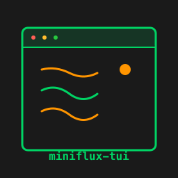

# miniflux-tui-py

<div align="center">
  
</div>

A Python Terminal User Interface (TUI) client for [Miniflux](https://miniflux.app) - a self-hosted RSS reader. This tool provides a keyboard-driven interface to browse, read, and manage RSS feeds directly from the terminal.

## Status

**Production/Stable**

This project has reached production stability with comprehensive features including runtime theme switching and non-blocking background operations, robust CI/CD, and high test coverage across Python 3.11-3.15.

## Features

### Core Functionality
- 📖 **Browse and read** RSS entries with keyboard navigation
- ✓ **Mark entries** as read/unread, starred/unstarred
- 💾 **Save entries** to third-party services (Pocket, Instapaper, etc.)
- 🌐 **Open in browser** or fetch original content for truncated entries
- 📝 **HTML to Markdown** conversion for readable display

### Organization & Filtering
- 🗂️ **Multiple sort modes** - date (newest first), feed (alphabetical), or status (unread first)
- 📁 **Group by feed** or category with expand/collapse
- 🔍 **Filter by status** - unread only or starred only
- 🔎 **Search** through entries by title or content
- 🏷️ **Category management** - organize feeds into categories

### Feed Management
- 🔄 **Auto-discover** feeds from URLs
- ⚙️ **Configure feeds** - scraping rules, rewrite rules, fetch settings, blocklist/allowlist
- 🔁 **Refresh feeds** - individual feeds or all feeds
- 📊 **Feed status** - view problematic feeds and errors
- 🛠️ **Feed settings editor** - comprehensive feed configuration

### User Experience
- ⌨️ **Keyboard-driven** - extensive Vim-style shortcuts
- 🎨 **Runtime theme switching** - toggle dark/light mode instantly with 'T' key (v0.7.0+)
- 🔄 **Non-blocking sync** - navigate and read entries while syncing in background (v0.7.0+)
- 📚 **Reading history** - browse your 200 most recently read entries
- 🔐 **Password manager** integration for secure credential storage
- 📦 **Multi-platform** - Linux, macOS, Windows support

## Quick Start

### Installation (Recommended with uv)

```bash
# Install uv - see https://docs.astral.sh/uv/getting-started/installation/
# On macOS/Linux: brew install uv
# On Windows: choco install uv

# Install miniflux-tui-py
uv tool install miniflux-tui-py
```

### Configuration

Create your configuration with:

```bash
miniflux-tui --init
```

This writes a starter config file. Edit it to set your server URL and the
password command that retrieves your Miniflux API token from a password manager.

### Running

```bash
miniflux-tui
```

See the [Installation Guide](installation.md) for more options including pip and source installation.

## Key Bindings

| Key       | Action               |
|-----------|----------------------|
| `j` / `k` | Navigate down/up     |
| `Enter`   | Open entry           |
| `m`       | Mark as read/unread  |
| `*`       | Toggle star          |
| `s`       | Cycle sort mode      |
| `g`       | Toggle group by feed |
| `l` / `h` | Expand/collapse feed |
| `r`       | Refresh current feed |
| `Shift+R` | Refresh all feeds    |
| `,`       | Sync from server     |
| `u`       | Show unread entries  |
| `t`       | Show starred entries |
| `/`       | Search entries       |
| `Shift+M` | Manage categories    |
| `Shift+H` | Toggle history view  |
| `X`       | Open feed settings   |
| `Shift+T` | Toggle theme         |
| `?`       | Show help            |
| `i`       | Show system status   |
| `q`       | Quit                 |

## Documentation

- [Installation Guide](installation.md)
- [Configuration](configuration.md)
- [Usage Guide](usage.md)
- [Contributing](contributing.md)
- [API Reference](api/client.md)

## Requirements

- Python 3.11 or later (tested on 3.11, 3.12, 3.13, 3.14, 3.15 preview)
- A running Miniflux instance
- Terminal with 24+ colors (for best experience)

## License

MIT License - see LICENSE file for details

## Author

Peter Reuterås ([@reuteras](https://github.com/reuteras))
