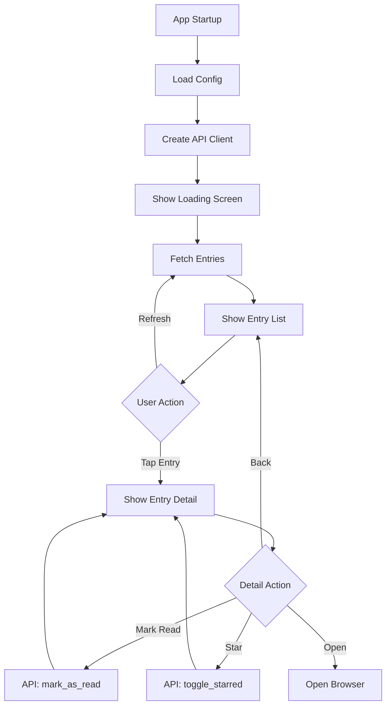

# Miniflux GUI (Toga)

This directory contains the **GUI version** of miniflux-tui-py, built with BeeWare Toga for iOS, Android, and desktop platforms.

## Architecture

The GUI version reuses core components from the TUI version:

```
miniflux_tui/
├── api/                   ← Shared (100% reused)
│   ├── client.py          - Async Miniflux API wrapper
│   └── models.py          - Data models (Entry, Feed, Category)
├── config.py              ← Shared (100% reused)
├── ui/                    ← TUI-specific (Textual framework)
└── gui/                   ← GUI-specific (Toga framework)
    ├── __init__.py
    ├── app.py             - Main Toga application
    └── README.md          - This file
```

## Files

### `app.py`

Main Toga application with three screens:

1. **Loading Screen**: Shows while entries are being fetched
2. **Entry List Screen**: Displays unread entries with:
   - Entry title
   - Feed name
   - Publication date
   - Refresh button
3. **Entry Detail Screen**: Shows full entry with:
   - Title, feed, date
   - Content (HTML converted to plain text)
   - Actions: Mark read/unread, star/unstar, open in browser
   - Back button

### Key Classes

#### `MinifluxGUI(toga.App)`

Main application class that manages:
- Configuration loading
- API client initialization
- Screen navigation
- Entry list state
- User actions (mark read, star, refresh)

#### Screen Creation Methods

- `create_loading_screen()` - Loading indicator
- `create_config_error_screen()` - Configuration error message
- `create_entry_list_screen()` - Entry list with DetailedList widget
- `create_entry_detail_screen(entry)` - Entry detail view

#### Event Handlers

- `on_entry_select(widget, row)` - Handle entry tap
- `on_back_to_list(widget)` - Navigate back to list
- `on_refresh(widget)` - Reload entries from API
- `on_toggle_read(entry)` - Toggle read/unread status
- `on_toggle_star(entry)` - Toggle starred status
- `on_open_browser(entry)` - Open URL in browser

## Data Flow



## Toga Widgets Used

### Layout

- `toga.Box` - Container for layouts (ROW/COLUMN)
- `toga.MainWindow` - Top-level window

### Display

- `toga.Label` - Text display (titles, metadata)
- `toga.DetailedList` - Entry list with title/subtitle
- `toga.MultilineTextInput` - Read-only content display

### Input

- `toga.Button` - Action buttons (refresh, back, mark read, etc.)

### Styling

- `toga.style.Pack` - CSS-like styling (flexbox)
  - `direction=COLUMN` - Vertical layout
  - `direction=ROW` - Horizontal layout
  - `flex=1` - Flexible sizing
  - `padding=10` - Spacing

## Async Operations

All API calls are async and use `asyncio.create_task()`:

```python
# Example: Load entries asynchronously
async def load_entries(self):
    self.entries = await self.client.get_unread_entries()
    self.main_window.content = self.create_entry_list_screen()

# Trigger from sync context
asyncio.create_task(self.load_entries())
```

## Entry Point

The GUI app is launched via:

```python
def main():
    """Entry point for the GUI application."""
    return MinifluxGUI()
```

Registered in `pyproject.toml` as:

```toml
[project.scripts]
miniflux-gui = "miniflux_tui.gui.app:main"
```

## Development

### Run on Desktop

```bash
# Development mode (fast iteration)
briefcase dev

# Or run directly
python -m miniflux_tui.gui.app
```

### Run on iOS Simulator

```bash
# Create Xcode project (first time only)
briefcase create iOS

# Build and run
briefcase run iOS
```

### Update After Code Changes

```bash
# Fast update (doesn't rebuild everything)
briefcase update iOS
briefcase run iOS
```

## Adding New Screens

To add a new screen:

1. **Create screen method**:
   ```python
   def create_my_screen(self) -> toga.Box:
       box = toga.Box(style=Pack(direction=COLUMN, padding=10))
       # Add widgets...
       return box
   ```

2. **Navigate to screen**:
   ```python
   def on_navigate_to_my_screen(self, widget):
       self.main_window.content = self.create_my_screen()
   ```

3. **Add back button** (if needed):
   ```python
   back_button = toga.Button(
       "← Back",
       on_press=self.on_back_to_previous_screen,
       style=Pack(padding=5),
   )
   ```

## Adding API Actions

To add a new API action:

1. **Add async handler**:
   ```python
   async def on_my_action(self, entry: Entry):
       if not self.client:
           return
       try:
           await self.client.my_api_call(entry.id)
           # Update UI
       except Exception as e:
           self.show_error(f"Action failed: {e}")
   ```

2. **Wire up button**:
   ```python
   button = toga.Button(
       "My Action",
       on_press=lambda w: asyncio.create_task(self.on_my_action(entry)),
       style=Pack(padding=5),
   )
   ```

## Limitations

### Current Limitations

1. **No sorting/filtering UI** - Entry list shows all unread entries
2. **Basic content rendering** - HTML tags are stripped, no rich formatting
3. **No image display** - Enclosures are not shown
4. **No offline support** - Requires internet connection
5. **No background sync** - Manual refresh only

### Platform-Specific Limitations

#### iOS
- No keyboard shortcuts (touch-only)
- Cannot run in background indefinitely
- Must use Apple's WebView for in-app browsing

#### Android
- Similar to iOS limitations
- Different native widgets (Material Design vs iOS)

## Future Improvements

### High Priority

- [ ] Add search functionality
- [ ] Implement starred entries view
- [ ] Add sort/filter controls
- [ ] Better HTML rendering (preserve formatting)
- [ ] Display images from enclosures

### Medium Priority

- [ ] Category browsing
- [ ] Feed management UI
- [ ] Settings screen
- [ ] Offline reading
- [ ] Background sync

### Low Priority

- [ ] iOS Widgets
- [ ] Push notifications
- [ ] iCloud sync
- [ ] Share extension

## Testing

### Manual Testing Checklist

- [ ] App launches without errors
- [ ] Configuration loads correctly
- [ ] Entry list displays unread entries
- [ ] Entry selection shows detail view
- [ ] Mark read/unread works
- [ ] Star/unstar works
- [ ] Open in browser works
- [ ] Refresh reloads entries
- [ ] Back navigation works
- [ ] Error handling shows dialogs

### Automated Testing

Currently, the GUI version has no automated tests. Contributions welcome!

## References

- [Toga Widget Gallery](https://toga.readthedocs.io/en/stable/reference/widgets.html)
- [Toga Layout Guide](https://toga.readthedocs.io/en/stable/reference/style/pack.html)
- [Briefcase Tutorial](https://docs.beeware.org/en/latest/tutorial/tutorial-0.html)

---

For more information, see [IOS_GUI.md](../../IOS_GUI.md) in the project root.
